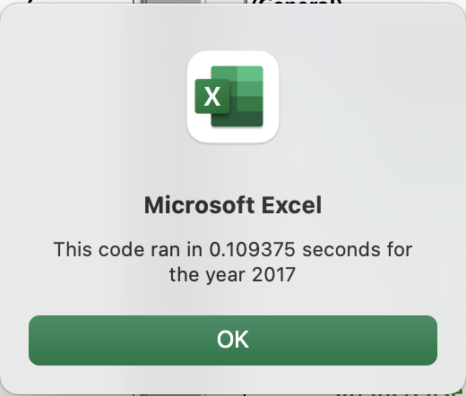
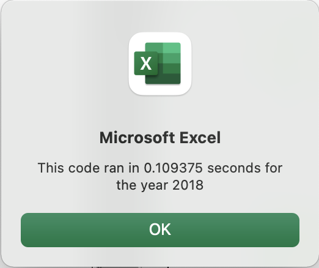

# VBA_Challenge
UCB DS Course Module 2 Excel VBA Challenge 

Overview of Project 

Module 2 Excel VBA Challenge explores the ability to extend the stock analysis to thousands of stocks with more modular and refactored code. To this aim the main processing for loop is re-written and time differential is measured. 

Results 

Timestamps indicates that refactored code increases code speed by a factor of 2 (i.e. from ~0.2 to ~0.1 seconds) for 2017 and 2018 (see screenshots below). The efficiency improvement can be attributed to the replacement of the nested for loop with a single one which store revelant information in arrays. For example, the outermost for loop was removed with the help of a tickerIndex variable which would be incremented from within the "inner" for loop. Both start and end prices were placed in arrays so that they could be looped over separately for display purposes. O(n^2) run time complexity was reduced to O(n) linear time.

Summary 

Advantages of the refactored code include but are not limited to increased clock speed/faster run time complexity as well as shorter/more compact code which may be easier to read. The disadvantage of refactoring is increased code complexity; in our simple case there were only three arrays to be created but in more elaborate real-world scenarios it might be more difficult to streamline.

Advantages of the original code include simplicity of design and legibility. As previously discussed, however, run time is inefficient due to nested for looping. Furthermore, it can only handle a lesser volume of stock inputs b/c it does not store looped information in arrays.  
